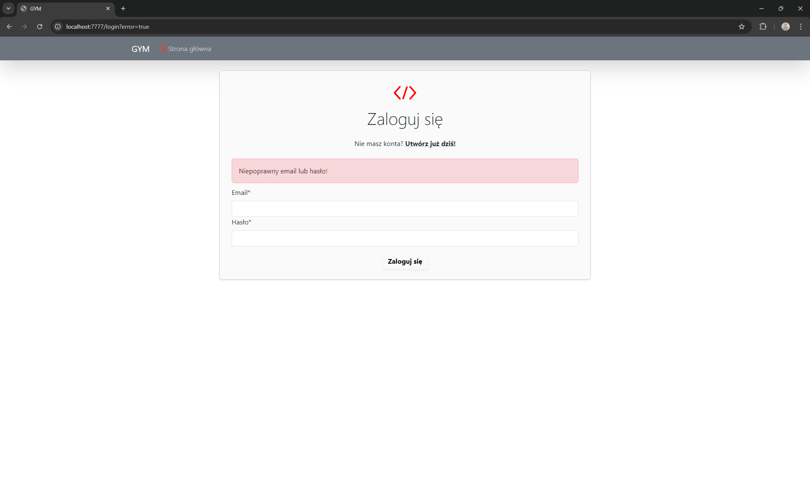
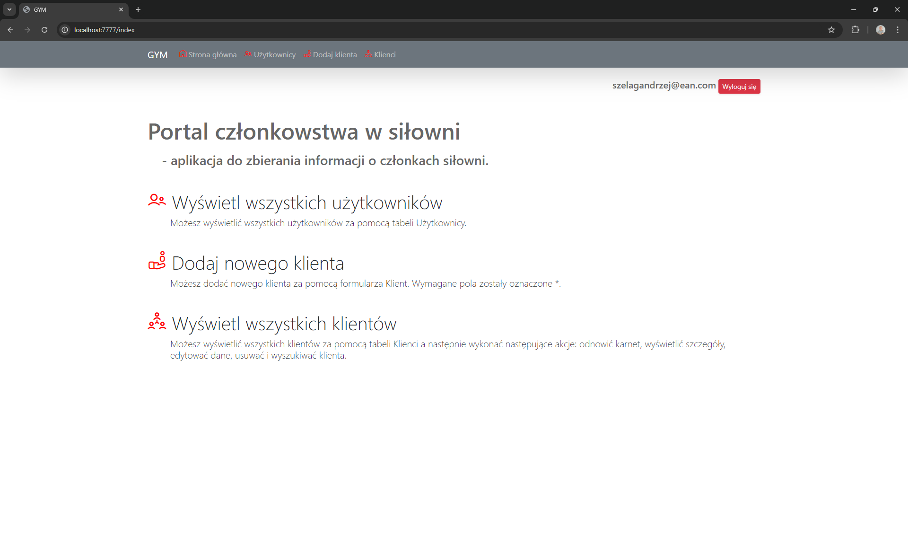
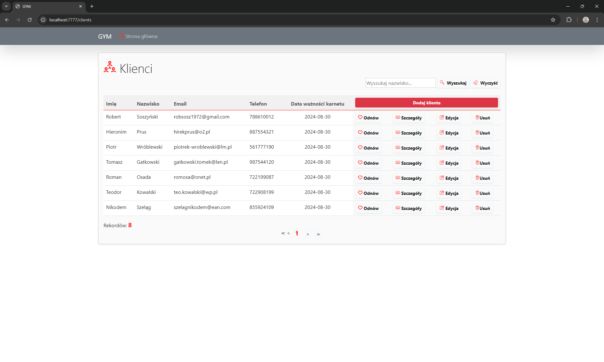

# GYM
### A web-based business application with Spring Boot to collect information about the members of a gym

🔶🔶🔶 Inside this project you find: __Builder Design Pattern__ 🔶🔶🔶 

### Tech Stack
* 🔶 Java 17.0.6 LTS
* 🔶 Spring Boot 3.3.2
* 🔶 Apache Maven 3.9.8
* 🔶 Hibernate ORM 6.6.0.Final
* 🔶 Lombok 1.18.34
* 🔶 PostgreSQL 16.3

### Testing
* 🔶 JUnit 5.9.3
* 🔶 AssertJ 3.26.3
* 🔶 Mockito 5.13.0

### IDE
* 🔶 IntelliJ IDEA 2024.1.4 (Ultimate Edition)

### Video
Coming Soon

### Requirements & How to run

1. Log into __Windows 11 Pro__ with a user that is a direct member of the Administrators group. 
2. Download, install and configure:
   * __Java 17.0.6 LTS__,
   * __Apache Maven 3.9.8__,
   * __PostgreSQL 13.6__:

**ATTENTION**: You need to create a schema, database, user, password and put them in the __application.properties__ file:

          spring.datasource.url=jdbc:postgresql://localhost:5432/<YOUR_DATABASE>
          spring.datasource.username=<YOUR_USER>
          spring.datasource.password=<YOUR_PASSWORD>
          spring.jpa.hibernate.ddl-auto=update

3. Clone a Github Repository to __D:__ partition:

          git clone https://github.com/AndrzejSzelag/gym.git

4. In command line Windows, go to folder __D:\gym__, and run command: 

        mvn clean install
        
5. In command line Windows, go to folder __D:\gym\target__ and run command:

        java -jar gym-1.0.0.jar

6. In your Web browser paste a URL:

          https://localhost:7777

**ATTENTION**: 
1. You should see the login page of the GYM application. 
2. You should register a new user and log in on his account next.
