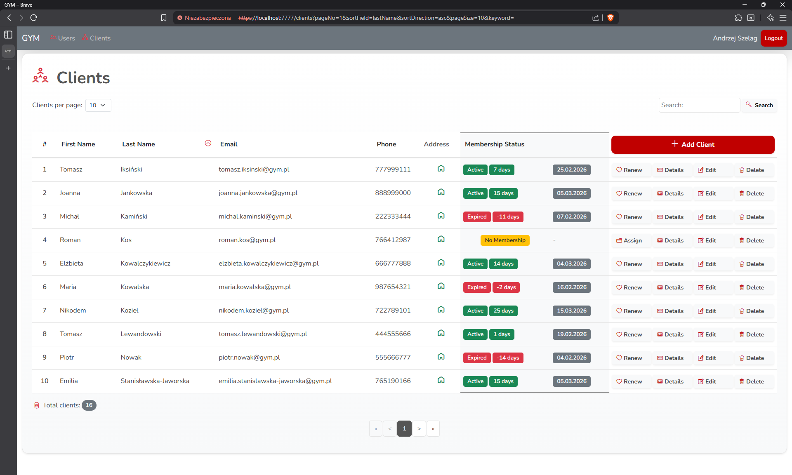
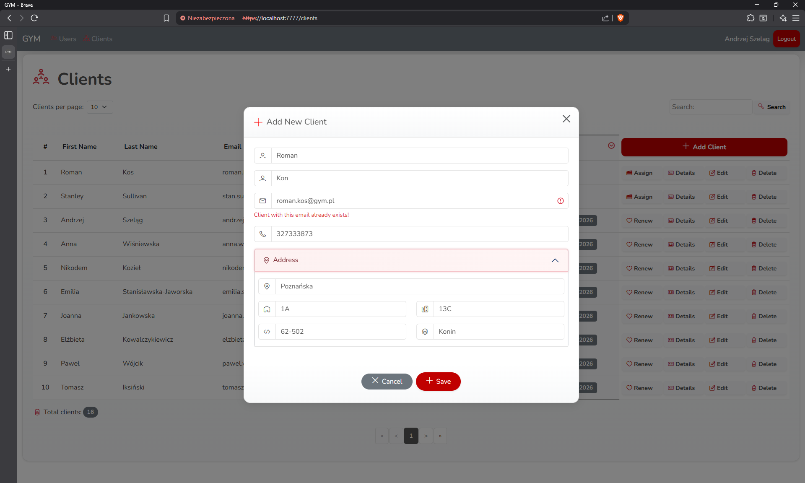
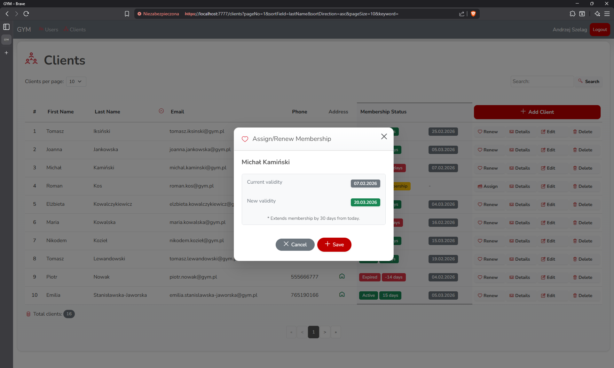

# GYM   


A professional web application for managing gym memberships, built with **Java 21 LTS**, **Spring Boot 3.4.2**,
and **PostgreSQL 16**.

The system emphasizes **security-first design**, **clean architecture**, and **high developer ergonomics**,
combining RBAC authorization, HTTPS, automated infrastructure, and a full quality pipeline.

## Project Overview





## Application Architecture

The application is built using a classic Spring MVC architecture. All HTTP interactions are handled via MVC controllers
returning rendered views using **Thymeleaf** templates, following the **Redirect-After-Post (PRG)** pattern.

The system features a **Full Entity Auditing** mechanism, automatically tracking not only timestamps but also the identity
of the user performing changes, ensuring complete accountability.

The system is designed as a monolithic Spring Boot application with clear separation between:
- presentation layer (MVC controllers and views),
- application/service layer,
- domain model,
- infrastructure concerns.

```text
┌─────────────────────────────────────┐
│        Web Browser (HTTPS)          │
└─────────────────┬───────────────────┘
                  │
┌─────────────────▼───────────────────┐
│   Spring Security (6.x)             │
│   - AuthN / AuthZ (RBAC)            │
│   - JPA Auditor Context Injection   │
└─────────────────┬───────────────────┘
                  │
┌─────────────────▼───────────────────┐
│   Controller Layer (MVC)            │
│   - Request routing / Response      │
└─────────────────┬───────────────────┘
                  │
┌─────────────────▼───────────────────┐
│   Service Layer (Business Logic)    │
│   - Core rules / Transaction        │
└─────────────────┬───────────────────┘
                  │
┌─────────────────▼───────────────────┐
│   Repository Layer (JPA/Hibernate)  │
│   - Automated Entity Auditing       │
└─────────────────┬───────────────────┘
                  │
┌─────────────────▼───────────────────┐
│   PostgreSQL (Data Storage)         │
└─────────────────────────────────────┘
```

## Database Model

The relational schema is designed for data integrity, featuring explicit constraints, indices, 
and comprehensive audit columns (`created_at`, `created_by`, `updated_at`, `last_modified_by`) on all core tables.

For a detailed ERD and schema description, see: **[Database Model Documentation](docs/database-model.md)**

## Key Features
- **Role-Based Access Control (RBAC)** with Spring Security.
- **Full Audit Trail**: Automated tracking of "who changed what and when" at the JPA layer.
- **Secure Communication**: Enforced HTTPS with self-signed certificate support.
- **Member Management**: CRUD flows with sanitization, normalization, and pagination.
- **Infrastructure as Code**: Automated provisioning via Docker Compose.
- **Quality Pipeline**: Static analysis (SonarQube/Checkstyle) and high test coverage.
- **Robust Data Integrity**: Automatic sanitization and normalization of personal data within the domain entities.

## Tech Stack

- **Backend**: Java 21 LTS, Spring Boot 3.4.2, Spring Security 6.4.2, Spring Data JPA 
- **Database**: PostgreSQL 16
- **Frontend**: Thymeleaf, Bootstrap 5
- **DevOps & Quality**: Docker, Maven, SonarQube, JaCoCo, Checkstyle

## Quick Start

This project is intended for local development and technical evaluation purposes.

### 1. Prerequisite & Cloning
- Java 21 LTS
- Maven 3.9+
- Docker Desktop

```bash
git clone https://github.com/AndrzejSzelag/gym.git
cd gym
```

### 2. Generate SSL Certificate

Generate a self-signed certificate for HTTPS:

```bash
keytool -genkeypair -alias tomcat -keyalg RSA -keysize 4096 -sigalg SHA256withRSA -keystore keystore.p12 -storetype PKCS12 -validity 730 -ext SAN=dns:localhost,ip:127.0.0.1 -dname "CN=localhost, OU=IT, O=GymApp, L=Konin, ST=Wielkopolskie, C=PL"
```

### 3. Configure Environment Variables
- Copy the provided template (`env.example`) to create your local environment file:

```bash
cp env.example .env
```
- Then, open `.env` and fill in your actual credentials (passwords, DB user, Sonar token).

### 4. Run with Docker

```bash
docker compose up -d --build
```

Access the application at: https://localhost:7777

> [!IMPORTANT]
> Development credentials only: Email: testuser@gym.pl Password: 111111

> [!WARNING]
> **SSL Security**: Since we are using a self-signed certificate for development, your browser will show a warning.
> Click **"Advanced"** and then **"Proceed to localhost"** to enter the site.

## Testing Strategy

Optimized for **fast feedback loops** and **high reliability**:
- **Persistent Integration Testing**: Uses a dedicated Docker PostgreSQL instance (port **5433**).
- **Auditor Verification:** Integration tests (**EntityAuditIT**) verify security context propagation to JPA audit fields.
- **Deterministic Seeding**: SQL-based data seeding for predictable test environments.
- **Unit Testing**: Mockito-based tests for configuration and logic (e.g., **AuditConfigTest**).

## Troubleshooting

<details>
<summary>
<b>Click to expand common issues</b>
</summary>

- DB connection refused → ensure PostgreSQL runs on port **5433**

- SSL warning → expected with self-signed certificate

- Sonar unauthorized → verify `SONAR_TOKEN` in `.env`

</details>

## Project Structure

For a detailed breakdown of the package organization and architecture decisions,
please refer to the **[Project Structure Documentation](docs/project-structure.md)**.

## License

This project is licensed under the [MIT License](LICENSE).

## Author

**Andrzej Szeląg** [GitHub Profile](https://github.com/AndrzejSzelag)
