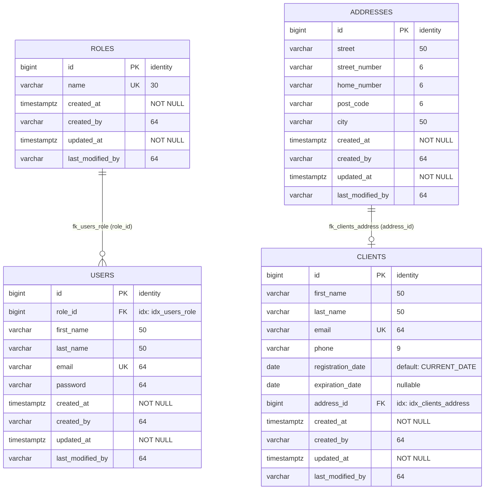

```mermaid
erDiagram
    ROLES ||--o{ USERS : "fk_users_role (role_id)"
    ADDRESSES ||--o| CLIENTS : "fk_clients_address (address_id)"

    ADDRESSES {
        bigint id PK "identity"
        varchar street "50"
        varchar street_number "6"
        varchar home_number "6"
        varchar post_code "6"
        varchar city "50"
        timestamptz created_at "NOT NULL"
        varchar created_by "64"
        timestamptz updated_at "NOT NULL"
        varchar last_modified_by "64"
    }

    CLIENTS {
        bigint id PK "identity"
        varchar first_name "50"
        varchar last_name "50"
        varchar email UK "64"
        varchar phone "9"
        date registration_date "default: CURRENT_DATE"
        date expiration_date "nullable"
        bigint address_id FK "idx: idx_clients_address"
        timestamptz created_at "NOT NULL"
        varchar created_by "64"
        timestamptz updated_at "NOT NULL"
        varchar last_modified_by "64"
    }

    ROLES {
        bigint id PK "identity"
        varchar name UK "30"
        timestamptz created_at "NOT NULL"
        varchar created_by "64"
        timestamptz updated_at "NOT NULL"
        varchar last_modified_by "64"
    }

    USERS {
        bigint id PK "identity"
        bigint role_id FK "idx: idx_users_role"
        varchar first_name "50"
        varchar last_name "50"
        varchar email UK "64"
        varchar password "64"
        timestamptz created_at "NOT NULL"
        varchar created_by "64"
        timestamptz updated_at "NOT NULL"
        varchar last_modified_by "64"
    }
```